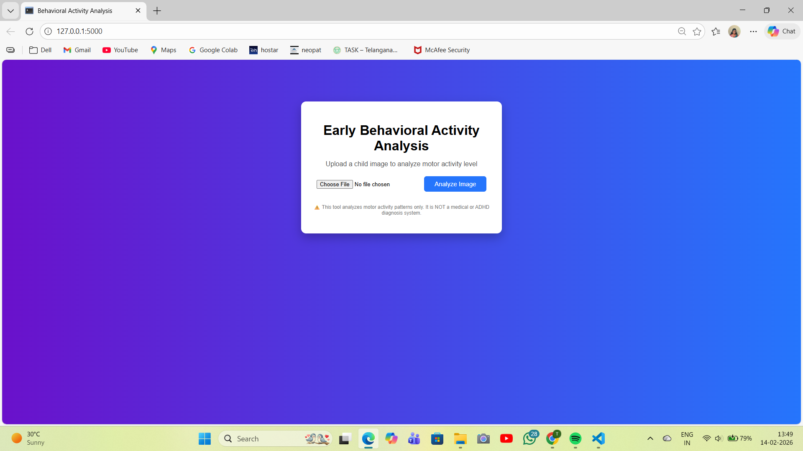
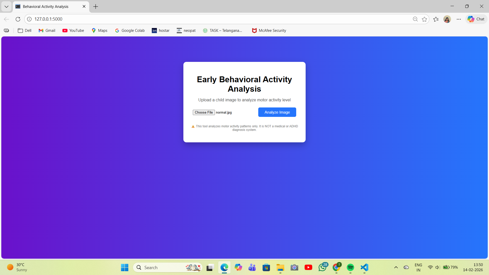
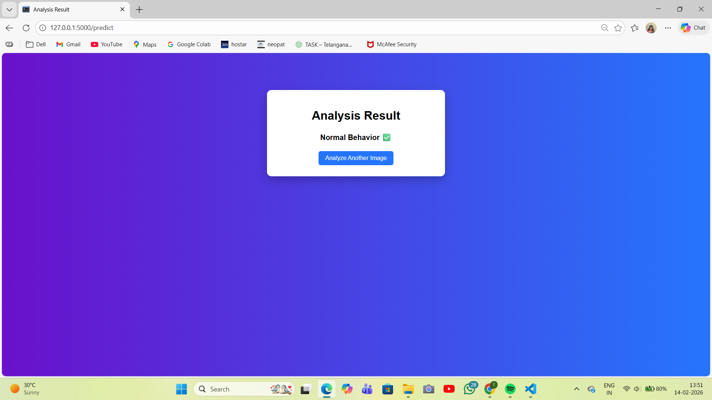
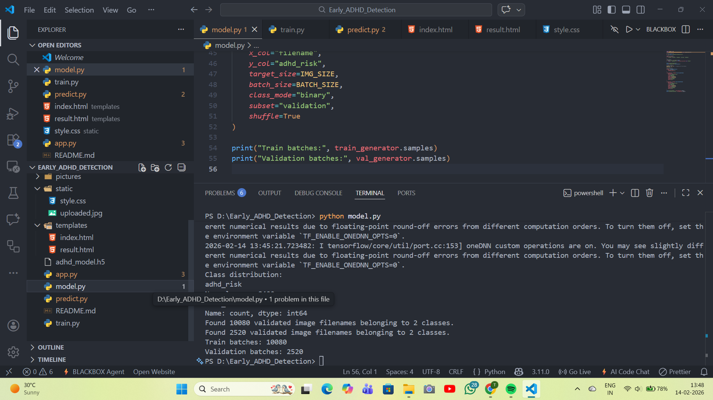

# 🧠 Early ADHD Risk Detection in Children Using Machine Learning

This project is a **CNN-based web application** designed for **early behavioral risk screening of ADHD in children** using **image-based motor activity analysis**.

 This system is **not a medical diagnostic tool**.  
It is intended only for **early risk identification** based on visual activity patterns.

---

##  Project Highlights

- Image-based behavioral analysis  
- Deep Learning (CNN) model  
- Binary classification:
  - Normal Behavior
  - ADHD Risk  
- Flask web application  
- Real-time image upload & prediction  
- Ethical and interview-safe framing  

---

##  Problem Statement

Early identification of ADHD-related behavioral patterns can help parents and professionals seek timely evaluation.

This project explores how **motor activity patterns in images** (such as running, jumping, or calm postures) can be analyzed using **deep learning** to flag **potential ADHD risk indicators**.

---

##  Tech Stack

### Backend
- Python  
- Flask  
- TensorFlow / Keras  

### Data & ML
- Convolutional Neural Network (CNN)  
- Image preprocessing & augmentation  

### Frontend
- HTML  
- CSS  

### Dataset
- Human Action Recognition (HAR) Image Dataset (Kaggle)

---

##  Input & Output

### Input
- Image of child activity (single image)

### Output
- **Normal Behavior ✅**
- **ADHD Risk Detected ⚠️**

---

##  Model Training Summary

- Image size: 128 × 128  
- Batch-based training (memory efficient)  
- Training Accuracy: ~92%  
- Validation Accuracy: ~82%  
- Loss stabilized without overfitting  

---

##  Screenshots

###  Home Page


---

###  Image Upload


---

###  Normal Behavior Result


---

###  ADHD Risk Result


---

###  Model Training


---

##  How to Run the Project

###  Install Dependencies
```bash
pip install -r requirements.txt
